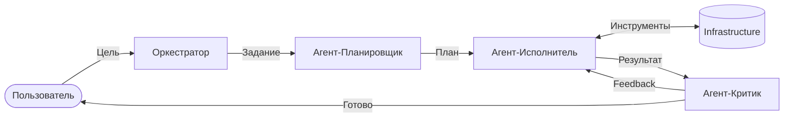

# Современные Архитектуры Кодирования 2025: Агентно-Центричный Подход

В 2025 году архитектура программного обеспечения сместилась от иерархии классов к иерархии **агентных взаимодействий**. Этот документ описывает стандарты построения систем, где ИИ является не надстройкой, а ядром (AI-Native).

---

## 🏗 Ключевые паттерны архитектуры

### 1. Агентно-Центричная Архитектура (Agent-Centric)

Система проектируется как набор автономных сущностей, обладающих четырьмя функциями:

* **Планирование (Planning):** Способность декомпозировать цель.
* **Память (Memory):** Удержание контекста и истории решений (Short-term & Long-term).
* **Рефлексия (Reflection):** Способность критически оценивать свою работу.
* **Инструменты (Tools):** Интерфейсы взаимодействия с внешним миром (API, БД, ФС).

### 2. Микроагентные сервисы (Micro-Agent Services)

Эволюция микросервисов, где каждый узел — это специализированный ИИ-агент.

* **Независимость:** Каждый агент имеет узкую специализацию (напр., "Аналитик безопасности" или "Оптимизатор запросов").
* **Интероперабельность:** Агенты общаются между собой через стандартизированные протоколы (напр., MCP).
* **Масштабируемость:** Можно добавлять новых "сотрудников" в систему, просто описывая их роль и давая доступ к инструментам.

---

## 🧼 Чистая Архитектура для ИИ (Clean Architecture for AI)

Чтобы система не превратилась в хаос "черных ящиков", применяются принципы разделения ответственности:

1. **Слой Домена (Domain Layer):** Чистая бизнес-логика и правила, не зависящие от того, какой ИИ их выполняет.
2. **Агентный Слой (Agentic Layer):** Здесь живут "личности" агентов, их промпты и стратегии рассуждения.
3. **Слой Инструментов (Infrastructure Layer):** Конкретные реализации инструментов (API банков, доступ к файлам, запуск кода). Это "руки" агентов.

---

## 🎼 Визуализация потока (Flow Visualization)

Современная архитектура описывается не UML-диаграммами классов, а графами состояний (State Graphs):

---

## 🚀 Практические рекомендации 2025

* **Детерминизм во главе:** Максимально ограничивайте волю ИИ там, где нужны четкие вычисления. Используйте агентов для принятия решений, но не для чистой арифметики.
* **Observability Hooks:** Встраивайте точки контроля ("слухачи") во внутренние монологи агентов, чтобы понимать, на каком этапе рассуждения произошла ошибка.
* **Plug-and-Play Models:** Проектируйте так, чтобы замена модели (напр., Gemini 3 на Claude 4) требовала только смены промпта, а не переписывания кода инфраструктуры.
